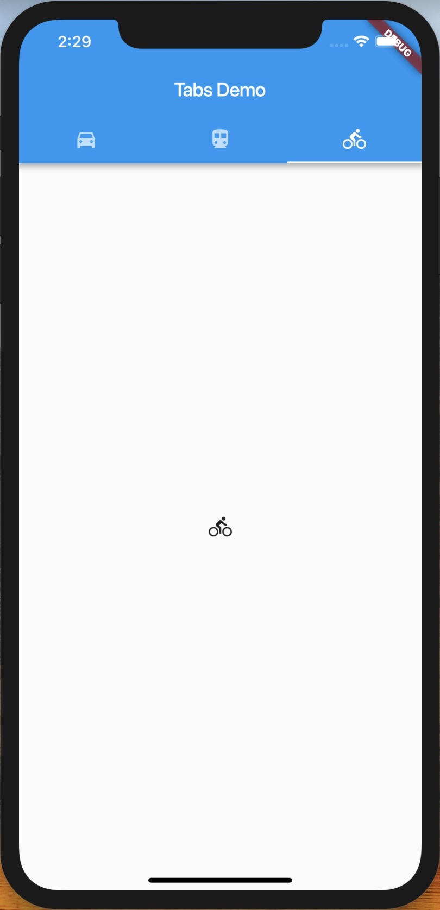
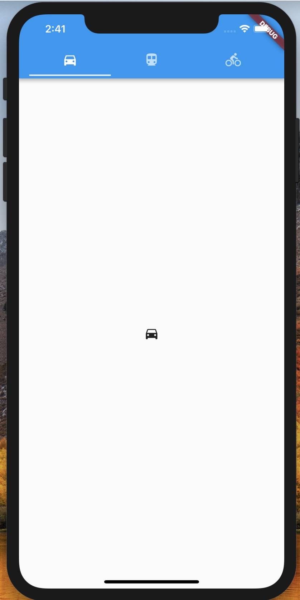

现如今打开一个 App，比如头条、滴滴，都能看到一个 Tab 导航切换栏，用来切换到不同的展示页。今天就用 Flutter 实现一下这种效果。

---

在 Flutter 里，基本上所有的东西都是组件。Flutter 已经提供了很多 `Material Design` 风格的组件，可以满足我们大部分的需求，像 Tab 这种基础组件，肯定是有提供的啦。具体可以看这里 [Components-Tabs](https://material.io/design/components/tabs.html#theming) ，写的很详细了，里面有一些 do 和 don't ， 遵循这些规则，可以提供更好的用户体验。

---

1. 首先，实现基础的骨架

```dart
import 'package:flutter/material.dart';

void main() => runApp(MyApp());

class MyApp extends StatelessWidget {
  @override
  Widget build(BuildContext context) {
    return MaterialApp(
      title: 'Flutter Study',
      home: Center(child: Text('Hello Tab')),
    );
  }
}
```

2. TabController

当我们切换 Tab 导航栏时，Tab 的内容要跟着发生改变，这个就是需要 TabCOntroller 来完成的。想要简单地实现，使用 DefaultTabController 就可以了。当然，你也可以不用，自定义你的 TabController ，参考 [TabController class](https://docs.flutter.io/flutter/material/TabController-class.html)。两者的区别就在于是否 TabBar 和 TabBarView 是父组件是否有状态。

```dart
DefaultTabController(
  // The number of tabs / content sections we need to display
  length: 3,
  child: // See the next step!
);
```

3. Tab 位置

一般来说，Tabs 可以放置在顶部栏，如 app bar。这也是我们使用 App 时常会看到的一种布局方式。得益于 Material 提供了一个 Scaffold 组件，我们是可以很方便地实现脚手架布局，包括顶部导航栏、中间内容、底部导航等。

```dart
DefaultTabController(
  length: 3,
  child: Scaffold(
    appBar: AppBar(
      bottom: TabBar(
        tabs: [
          Tab(icon: Icon(Icons.directions_car)),
          Tab(icon: Icon(Icons.directions_transit)),
          Tab(icon: Icon(Icons.directions_bike)),
        ],
      ),
    ),
  ),
);
```

4. 每个 Tab 的内容

当选中一个 Tab 的时候，就要展示这个 Tab 对应的内容。也就是说这里的 TarBarView 是要和 TabBar 一一对应的。

```dart
TabBarView(
  children: [
    Icon(Icons.directions_car),
    Icon(Icons.directions_transit),
    Icon(Icons.directions_bike),
  ],
);

```
仿真器看到的效果如图所示：



可能，有一些人的需求是会不需要 app bar 中的标题部分，直接把 Tab 置于最上方的位置，这个其实也不难处理。之前我们是把 TabBar 放在 AppBar 的 bottom 位置，现在放在 title 位置就好了嘛
```dart
DefaultTabController(
  length: 3,
  child: Scaffold(
    appBar: AppBar(
      title: TabBar(
        tabs: [
          Tab(icon: Icon(Icons.directions_car)),
          Tab(icon: Icon(Icons.directions_transit)),
          Tab(icon: Icon(Icons.directions_bike)),
        ],
      ),
    ),
  ),
);
```
效果如图：



完整的代码看这里 [tab_bar.dart](../code/tab_bar.dart)

---
## 参考资料

[Components-Tabs](https://material.io/design/components/tabs.html#theming)
[DefaultTabController class](https://docs.flutter.io/flutter/material/DefaultTabController-class.html)
[Tabbed AppBar](https://flutter.io/docs/catalog/samples/tabbed-app-bar)
